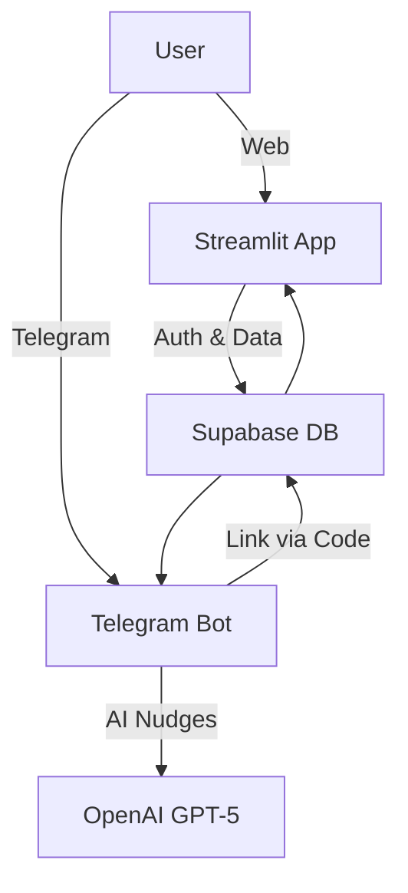
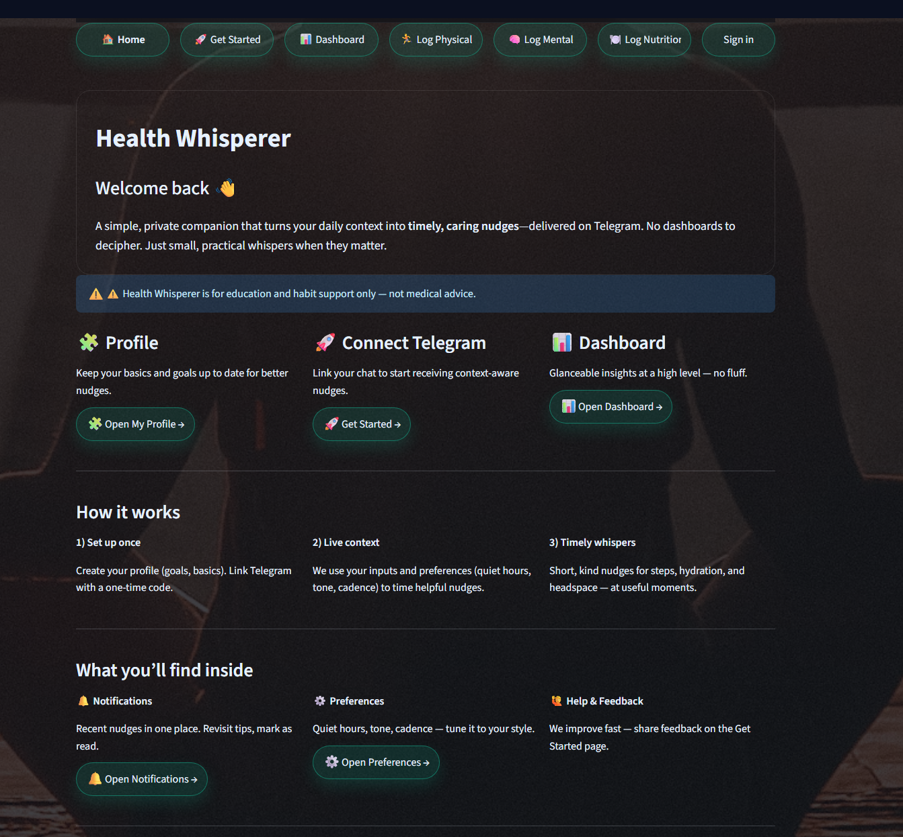
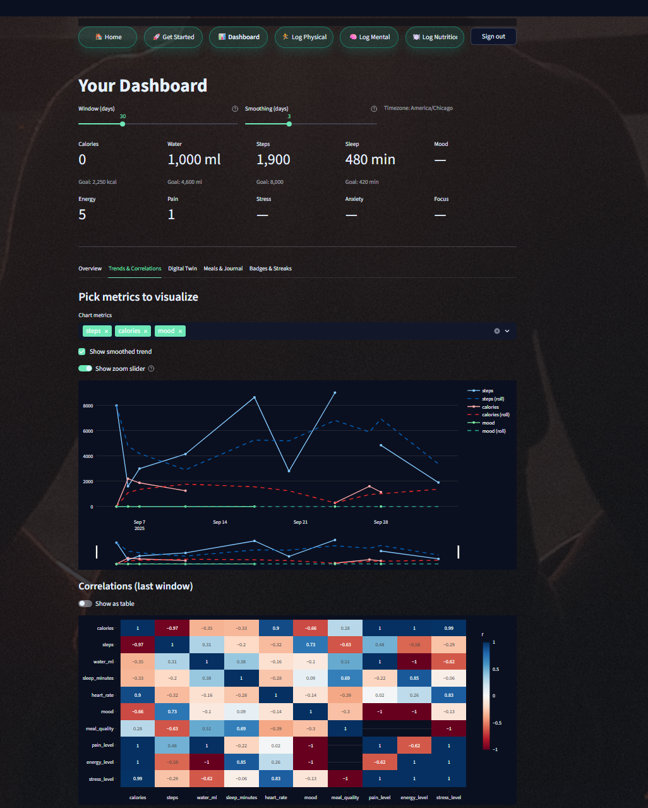
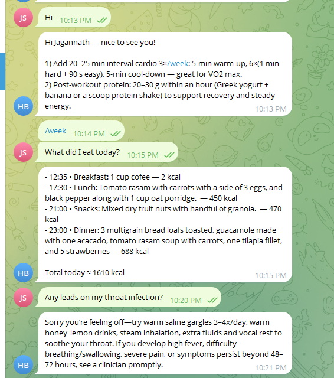
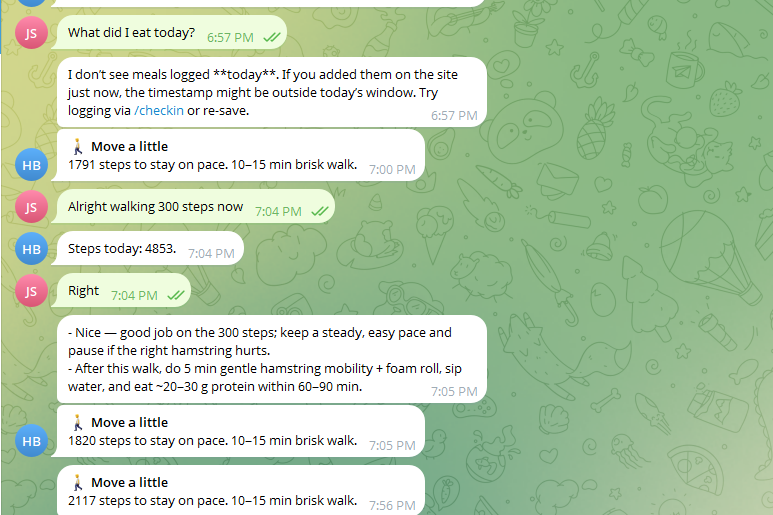
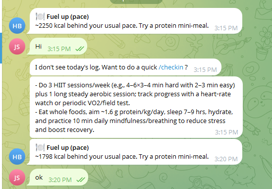

# 🩺 Health Whisperer

**Health Whisperer** is your **personal AI health companion** that transforms scattered data into **timely, caring nudges**.  
It integrates **Streamlit**, **Supabase**, **Telegram**, and **OpenAI GPT-5** to provide an all-in-one wellness experience across **physical, mental, and nutritional health**.

⚠️ **Disclaimer**: This is an **educational prototype**, not medical advice.

---

## ✨ Features

- **Streamlit Web App**
  - Secure sign-up/sign-in with Supabase.
  - Personalized profile intake (demographics, goals, lifestyle).
  - Dashboard with BMI, hydration, steps, and goal tracking.
  - Interactive goal tuning (steps & water).

- **Telegram Bot**
  - Link your account with a one-time code.
  - Receive **personalized nudges** (hydration, movement, stress relief).
  - Chat directly with your AI health assistant.

- **AI Nudges (Powered by GPT-5)**
  - Context-aware suggestions using your profile + logs.
  - Empathetic, concise, and **not overwhelming**.
  - Covers mental, physical, and nutritional health.

- **Future: Digital Twin**
  - Visualize the long-term impact of today’s choices.
  - Gamification with streaks, badges, and weekly summaries.

---

## 🏗️ Architecture



- **Frontend**: Streamlit (Python)  
- **Backend/DB**: Supabase (Postgres + Auth + RLS policies)  
- **Bot**: Python-Telegram-Bot  
- **AI Engine**: OpenAI GPT-5  

---

## 📸 Screenshots

### Landing Page


### Dashboard


### Telegram Bot





*(Place your images in `docs/screenshots/` and update paths if needed.)*

---

## ⚙️ Setup

### 1. Clone the Repo
```bash
git clone https://github.com/Jagannath771/Health-Whisperer.git
cd Health-Whisperer
```

### 2. Install Dependencies
```bash
pip install -r requirements.txt
```

### 3. Configure Secrets
Create `.streamlit/secrets.toml`:
```toml
[supabase]
url = "https://YOUR-PROJECT-REF.supabase.co"
key = "YOUR-ANON-KEY"

[app]
bot_username = "HealthWhispererBot"
```

Create `.env` (for local dev and the Telegram bot):
```env
SUPABASE_URL=https://YOUR-PROJECT-REF.supabase.co
SUPABASE_KEY=YOUR-ANON-KEY
TELEGRAM_TOKEN=YOUR-TELEGRAM-BOT-TOKEN
OPENAI_API_KEY=YOUR-OPENAI-KEY
```

### 4. Initialize Supabase
Run this SQL in your Supabase SQL editor:

```sql
-- Profiles: one row per user
create table if not exists public.profiles (
  id uuid primary key references auth.users(id) on delete cascade,
  email text unique,
  full_name text,
  age int,
  gender text,
  height_cm numeric,
  weight_kg numeric,
  activity_level text,
  goals text,
  conditions text,
  medications text,
  timezone text,
  updated_at timestamptz default now()
);

-- Telegram linking: one-time code to associate telegram user
create table if not exists public.tg_links (
  user_id uuid primary key references auth.users(id) on delete cascade,
  link_code text unique not null,
  telegram_id bigint unique,
  created_at timestamptz default now()
);

-- Enable Row Level Security
alter table public.profiles enable row level security;
alter table public.tg_links enable row level security;

-- Policies so users can see/update only their row
create policy "profiles select own" on public.profiles
  for select using (auth.uid() = id);
create policy "profiles upsert own" on public.profiles
  for insert with check (auth.uid() = id);
create policy "profiles update own" on public.profiles
  for update using (auth.uid() = id);

-- Policies for tg_links
create policy "links select own" on public.tg_links
  for select using (auth.uid() = user_id);
create policy "links upsert own" on public.tg_links
  for insert with check (auth.uid() = user_id);
create policy "links update own" on public.tg_links
  for update using (auth.uid() = user_id);
```

### 5. Start the Web App
```bash
streamlit run app.py
```

### 6. Start the Telegram Bot
```bash
python telegram_bot/bot.py
```

---

## 📊 Example Dashboard

- **KPIs**: Weight, height, BMI, hydration, activity.  
- **Visuals**: Steps trend (14-day chart), hydration donut, progress bars.  
- **Goal Setting**: Quick sliders to update daily steps & water intake.  
- **AI Nudge Preview**: Ask GPT-5 for wellness tips.  

---

## 🚀 Roadmap

- [ ] Full health logs: meals, workouts, mood, water.  
- [ ] Smarter nudges with multi-agent AI (fitness, nutrition, mental health).  
- [ ] Digital Twin — simulate the *future you*.  
- [ ] Wearable & calendar integration.  
- [ ] Gamification: streaks, badges, weekly reports.  

---

## 🤝 Contributing

We welcome contributions!  

1. Fork the repo  
2. Create a branch (`feature/my-feature`)  
3. Commit your changes  
4. Push and open a Pull Request  

---

## 📜 License

MIT License — free to use and modify with attribution.

---

## 👨‍💻 Author

Built with ❤️ by **[Jagannath Sai](https://github.com/Jagannath771)**
